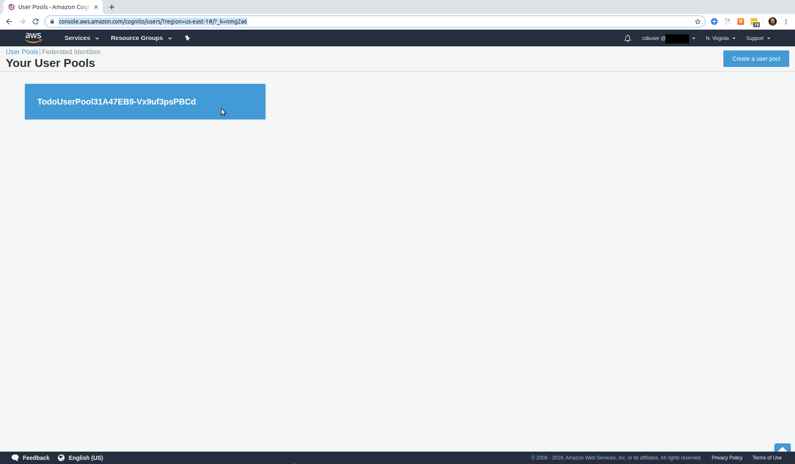

# A Serverless Project

Brought to you by [Dozen Software](https://dozensoft.com/)

## Blog Post #3 - Cognito

Cognito is an AWS service that handles user authentication for web or native applications. [More info](https://aws.amazon.com/cognito/)

For this project, I don't want to have to re-invent the wheel and figure out how to let users login, change their password, etc. And I don't have to because AWS offers Cognito, which packages up all of these reoccuring needs.

If you want to skip over the previous step, please complete the [first step](../01). And then do the following:

```sh
cd ~/projects
rm -rf my-cdk-project/*
cp -R serverless-cdk-cicd/02/. my-cdk-project/
cd my-cdk-project/cdk
npm i
npm run build && cdk synth
cdk deploy
```

## Steps

1. [CDK Code for Cognito](#cdk-code-cognito)
1. [CDK Code for the project](#cdk-code-project)
1. [Configure the Cognito UserPool](#configure-cognito)
1. [Create a UserPool App Client](#create-userpool-client)
1. [Create an Identity Pool](#create-identity-pool)
1. [Conclusion](#conclusion)

### Step 1: CDK Code for Cognito <a name="cdk-code-cognito"></a>

The first thing I want to do is create my Cognito UserPool. And for that, I'll need to install AWS's Cognito CDK npm package, like so...

```sh
cd cdk
npm i @aws-cdk/aws-cognito
```

Then, similar to my `cdk/lib/dynamodb.ts` file, I'm going to create a `cdk/lib/cognito.ts` file.

```js
import cdk = require("@aws-cdk/core");
import cognito = require("@aws-cdk/aws-cognito");

export class Cognito extends cdk.Stack {
  constructor(scope: cdk.Construct, id: string, props?: cdk.StackProps) {
    super(scope, id, props);
    const userpool = new cognito.UserPool(this, `TodoUserPool`, {
      signInType: cognito.SignInType.EMAIL,
      autoVerifiedAttributes: [cognito.UserPoolAttribute.EMAIL]
    });
  }
}
```

To read more about AWS's Cognito CDK npm package, [here is a link to the documentation](https://docs.aws.amazon.com/cdk/api/latest/docs/aws-cognito-readme.html).

### Step 2: CDK Code for the project <a name="cdk-code-project"></a>

Similar to [Step 2 of the second blog post](../02#cdk-code-project), we need to create an instance of our Cognito class. So the `cdk/bin/cdk.ts` file should now look like this.

```js
#!/usr/bin/env node
import "source-map-support/register";
import cdk = require("@aws-cdk/core");
import { DynamoDb } from "../lib/dynamodb";
import { Cognito } from "../lib/cognito";

const env = { region: "us-east-1" };

const app = new cdk.App();
new DynamoDb(app, "DynamoDb", { env });
new Cognito(app, "Cognito", { env });
```

Then we'll `build`, `synth`, and `deploy`. However, since we now have multiple stacks defined, we'll need to specify which stack(s) we want to deploy.

```sh
npm run build && cdk synth
cdk deploy TodoCognito
```

You should now see two CloudFormation stacks when you visit your console.


And you should see a UserPool in your [Cognito console](https://console.aws.amazon.com/cognito/users/?region=us-east-1).


### Step 3: Configure the Cognito UserPool <a name="configure-cognito"></a>

I want a pretty lax password policy for this project. I don't want to require any uppercase letters, lowercase letters, etc.

Unfortunately, the folks in charge of the Cognito CDK npm package didn't expose any methods for implementing a non-default password policy configuration. However! If we dive under the hood a bit, we can figure it out.

When you create a `new cognito.UserPool`, there is a child object called `node` and that object has a child object named `defaultChild`. This is not exposed in the typescript libraries, so your IDE may bark at you. But if you look at the first line in the snippet below, you can see that I'm casting this default child as a `CfnUserPool`.
When you see a CDK class with a `Cfn` prefix, it means that it is a CloudFormation resource. It's not quite as nice as a CDK resource, because you have to be a bit more verbose. But sometimes it's the only implemented way to get what you need.
Anyways, I can attach my desired policy configuration to this `CfnUserPool` and we're on our way.

WARNING: I haven't seen this documented anywhere, so I'd say it could be in danger of having a breaking change on any release.

```js
const cfnUserPool = userpool.node.defaultChild as cognito.CfnUserPool;

cfnUserPool.policies = {
  passwordPolicy: {
    minimumLength: 8,
    requireLowercase: false,
    requireUppercase: false,
    requireSymbols: false,
    requireNumbers: false,
    temporaryPasswordValidityDays: 7
  }
};
```

### Step 4: Create a UserPool App Client <a name="create-userpool-client"></a>

We'll need an App Client associated with our UserPool that can call unauthenticated APIs (APIs that do not have an authenticated user), such as APIs to register, sign in, and handle forgotten passwords. [Here is more information](https://docs.aws.amazon.com/en_pv/cognito/latest/developerguide/user-pool-settings-client-apps.html).

This is super easy.

Please note that the userPoolId is referencing the `userpool` that we created earlier in the `cdk/lib/cognito.ts` file.

```js
const cfnUserPoolClient = new cognito.CfnUserPoolClient(
  this,
  "TodoUserPoolClient",
  {
    clientName: "web",
    userPoolId: userpool.userPoolId,
    generateSecret: false
  }
);
```

### Step 5: Create an Identity Pool

An Identity Pool will enable us to authorize our users to access other AWS resources. Here, we will create an IdentityPool with one Identity Provider: our UserPool. Later, we could add federated providers like Login With Facebook, or Login with Google, etc.

```js
const identitypool = new cognito.CfnIdentityPool(
  this,
  `${projectname}${env}IdentityPool`,
  {
    cognitoIdentityProviders: [
      {
        providerName: cfnUserPool.attrProviderName,
        clientId: cfnUserPoolClient.ref
      }
    ],
    allowUnauthenticatedIdentities: false
  }
);
```

By the way, if you're having trouble finding how to reference a resource's `Id`, try its `ref` property (as seen above). It seems to be a carry-over from CloudFormation's [Ref function](https://docs.aws.amazon.com/AWSCloudFormation/latest/UserGuide/intrinsic-function-reference-ref.html).

After `npm run build`ing and `cdk deploy TotoCognito`ing, you should be able to see your new Identity Pool in your [Cognito Console](https://console.aws.amazon.com/cognito/federated?region=us-east-1).

### Conclusion <a name="conclusion"></a>

That's it. If you haven't already, you can `npm run build && cdk synth` and then `cdk deploy TodoCognito` and your changes should show up in the Console.

If anything is unclear, @ me on [twitter](https://twitter.com/murribu) or file an issue/pr on this repo.

You're ready for [Step 4](../04)
