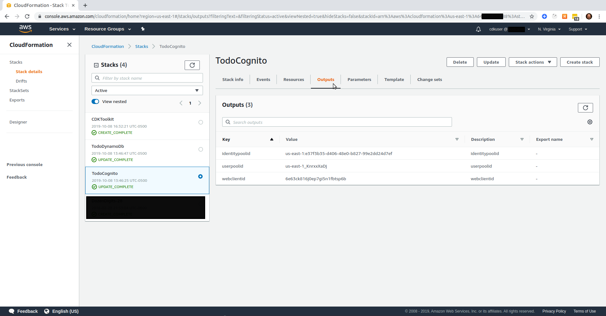
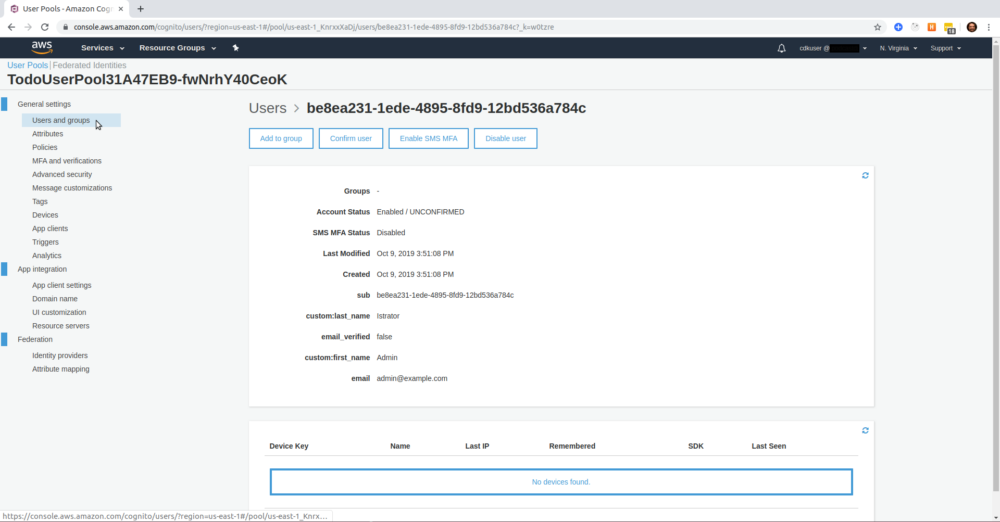
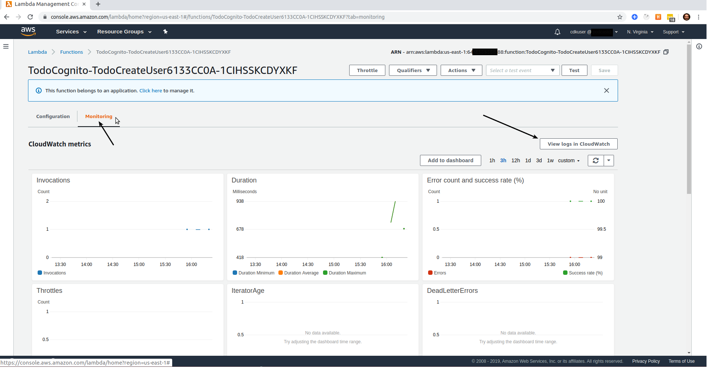
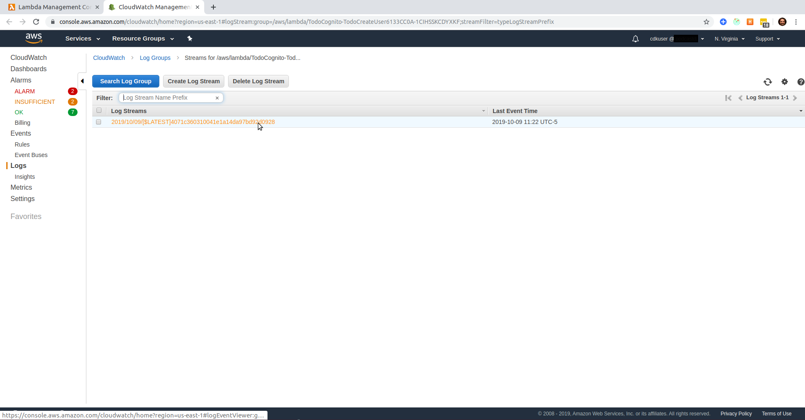
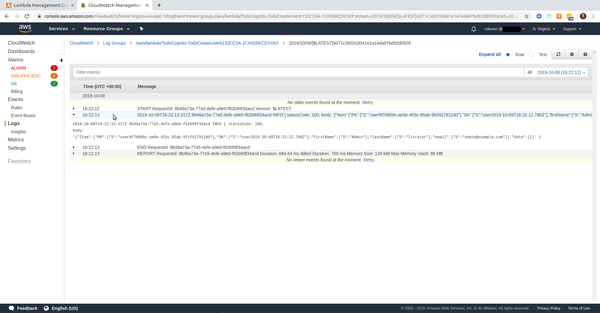

# A Serverless Project

## Blog Post #5 - Test what we have so far

In this post, we will use the aws-cli to create a user in our UserPool. We should then be able to see the user in Cognito, see the record in our DynamoDb table, and view Cloudwatch Logs to see that the Lambda worked.

If you want to skip over the previous steps, please complete the [first step](../01). And then do the following:

```sh
cd ~/projects
rm -rf my-cdk-project/*
cp -R serverless-cdk-cicd/04/. my-cdk-project/
cd my-cdk-project/cdk/assets/lambda/create-user
npm i
cd ../../..
npm i
npm run build && cdk synth
cdk deploy Todo*
```

## Steps

1. [Add Outputs to the Cognito stack](#outputs)
1. [Create a user](#create-user)
1. [Verify User](#verify-user)
1. [Check Dynamo](#dynamo)
1. [Check CloudWatch](#cloudwatch)
1. [Conclusion](#conclusion)

### Step 1: Add Outputs to the Cognito stack <a name="outputs"></a>

First, we will add some [CloudFormation Outputs](https://docs.aws.amazon.com/AWSCloudFormation/latest/UserGuide/outputs-section-structure.html) to our Cognito stack. This is so that we can programmatically identify the resources that we have provisioned.

```js
new cdk.CfnOutput(this, "userpoolid", {
  description: "userpoolid",
  value: userpool.userPoolId
});

new cdk.CfnOutput(this, "webclientid", {
  description: "webclientid",
  value: cfnUserPoolClient.ref
});

new cdk.CfnOutput(this, "identitypoolid", {
  description: "identitypoolid",
  value: identitypool.ref
});
```

Now, when I `npm run build && cdk synth` and `cdk deploy TodoCognito`, I will get a response that looks like this


And when I go to my CloudFormation Console, I can click on `Outputs` to see the same thing.


### Step 2: Create a user <a name="create-user"></a>

Since we installed the [AWS CLI](https://docs.aws.amazon.com/cli) in the [first blog post](../01#setup-cli), we can use it to create a new user.

You can refer to the [cognito documentation](https://docs.aws.amazon.com/cli/latest/reference/cognito-idp/index.html) for more specifics.

```sh
aws cognito-idp sign-up --region us-east-1 --client-id 6e63ck816j0ep7gi5n1fbtsp6b --username admin@example.com --password Passw0rd! --user-attributes '[{"Name":"custom:first_name","Value":"Admin"},{"Name":"custom:last_name","Value":"Istrator"}]'
```

I pasted in my webclientid from the output shown above. You should use your own webclientid.

This should result in the following:


And you should be able to visit your [Cognito Console](https://console.aws.amazon.com/cognito/users/?region=us-east-1), find your UserPool, click on `Users and groups`, and see your new user! If you click on your new user, you should see something like this.


### Step 3: Verify User <a name="verify-user"></a>

Remember that we have a trigger set to run when a user _verifies_ their account. Normally, the user would get an email with a 6-digit code. They would then provide that back to our application and it would tell the cognito api to verify them.
I don't have access to `admin@example.com`, so we can't do it that way. But we can use the AWS CLI to programmatically verify this user.

```sh
aws cognito-idp admin-confirm-sign-up --region us-east-1 --user-pool-id us-east-1_KnrxxXaDj --username admin@example.com
```

I pasted in my userpoolid from the output shown in [Step 1](#outputs). You should use your own userpoolid.

This won't give you any output or confirmation, but if you refresh the page where you were looking at your user in the Cognito Console, you should see that they are now confirmed.

But did our lambda work?

### Step 4: Check Dynamo <a name="dynamo"></a>

Go to your [Dynamo Console](https://console.aws.amazon.com/dynamodb/home?region=us-east-1#tables:) and click on your `Todos` table. If everything worked, you should see something like this


### Step 5: Check CloudWatch <a href="cloudwatch"></a>

Go to your [Lambda Console](https://console.aws.amazon.com/lambda/home?region=us-east-1#/functions) and click on the lambda function. It should be named something like `TodoCognito-TodoCreateUser6133CC0A-1CIHSSEXAMPLE`

Then click on `Monitoring` and then `View logs in Cloudwatch`


This should open a new tab where you'll see your CloudWatch Log Group. Click on the most recent entry (there will probably be only one).


Here, you can view the logging from the lambda function.


As you can see in the [lambda code](cdk/assets/lambda/createuer/index.ts#L23), I'm `console.log`ing a success message. And that's what was written in the CloudWatch Log.

This is a good way to debug your code, if something isn't working.

### Conclusion <a name="conclusion"></a>

The pieces are fitting together!

Next, we're going fold in our API.

If anything is unclear, @ me on [twitter](https://twitter.com/murribu) or file an issue/pr on this repo.

You're ready for [Step 6](../06)
