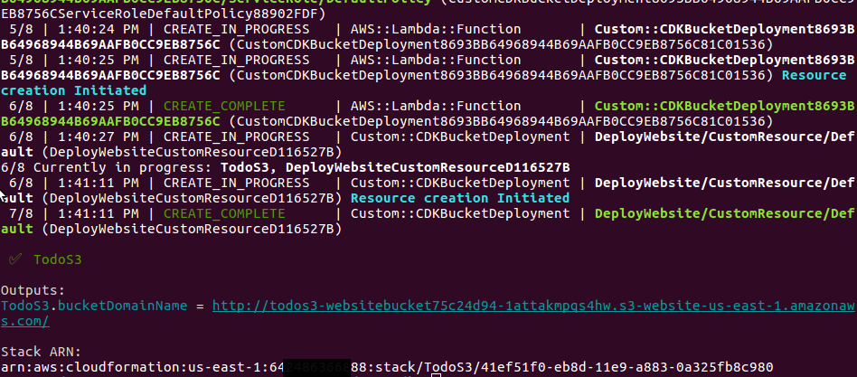

# A Serverless Project

## Blog Post #9 - S3 Static Hosted Site

S3 is AWS's object storage service. You can think of it as an infinite hard drive on AWS servers. [More info](https://aws.amazon.com/s3/)

First, you create a `bucket`, and then you can store files inside it.

What's more, you can set a property on the bucket that turns it into a website! [More info](https://docs.aws.amazon.com/AmazonS3/latest/dev/WebsiteHosting.html). In this blog post, we'll host our front end site in this way.

If you want to skip over the previous steps, please complete the [first step](../01). And then do the following:

```sh
cd ~/projects
rm -rf my-cdk-project/*
cp -R serverless-cdk-cicd/08/. my-cdk-project/
cd my-cdk-project/cdk/assets/lambda/create-user
npm i
cd ../../..
npm i
npm run build && cdk synth
cdk deploy Todo*
cdk deploy TodoCognito --require-approval never &> ../cdkdeployresult_cognito.txt
cdk deploy TodoAppsync --require-approval never &> ../cdkdeployresult_appsync.txt
cd ..
npm i
echo "export default {};" > src/config.js
node parseAwsOutputs.js src/config.js
```

### Steps

1. [Build our React project](#build)
1. [Create an S3 Stack](#s3)
1. [CDK Deploy](#deploy)
1. [Conclusion](#conclusion)

### Step 1: Build our React project <a name="build"></a>

The first thing we need to do is build a production version of our code. So, in the root directory (not the `cdk` directory)...

```sh
npm run build
```

This will create a `build` folder and stick all of the built assets for the project in there.

I have `.gitignore`d the `build` folder because it's not necessary to have in the repo.

### Step 2: Create an s3 Stack <a name="s3"></a>

First, we need to install a couple of dependencies

```sh
cd cdk
npm i @aws-cdk/aws-s3 @aws-cdk/aws-s3-deployment@1.11.0
```

I'm specifying the `1.11.0` version of this dependency because [this issue](https://github.com/aws/aws-cdk/issues/4404) is not yet resolved as of the time that I'm writing this.

Then we create our [cdk/lib/s3.ts](cdk/lib/s3.ts) file.

<details><summary>Click here to see the code inline</summary><p>

```js
import cdk = require("@aws-cdk/core");
import s3 = require("@aws-cdk/aws-s3");
import s3deploy = require("@aws-cdk/aws-s3-deployment");

export class S3 extends cdk.Stack {
  constructor(scope: cdk.Construct, id: string, props?: cdk.StackProps) {
    super(scope, id, props);

    const websiteBucket = new s3.Bucket(this, "WebsiteBucket", {
      websiteIndexDocument: "index.html",
      websiteErrorDocument: "index.html",
      publicReadAccess: true
    });

    new s3deploy.BucketDeployment(this, "DeployWebsite", {
      sources: [s3deploy.Source.asset("../build")],
      destinationBucket: websiteBucket
    });

    new cdk.CfnOutput(this, "bucketUrl", {
      description: "bucketUrl",
      value:
        "http://" +
        websiteBucket.bucketName +
        ".s3-website-us-east-1.amazonaws.com/"
    });
  }
}
```

</p></details>

#### websiteBucket

The first object we create is the `websiteBucket`. This will hold all of our front end code. The `websiteIndexDocument` and `websiteErrorDocument` both point to our `index.html` file because React Router can handle all the routing, including routing errors.

#### BucketDeployment

The `BucketDeployment` can be thought of as a pre-built lambda that handles pushing your code into your website's bucket. You can see that I'm telling it where my code is (the `../build` folder) and where I want it deployed to.

#### Output

Then I created a CloudFormation Output because I wanted to be able to visit this bucket's website after its created.

### Step 3: CDK Deploy <a name="deploy"></a>

```sh
cd cdk
npm run build && cdk synth
cdk deploy TodoS3
```

You should see some output that looks like this


And if you visit that link, you should see exactly what you saw locally. Try it out, and you should be able to log in

### Conclusion <a name="conclusion"></a>

We're done with the skeleton of our app! Obviously, it doesn't do much at this point. But in order to add functionality, you just have to add queries/mutations to your Appsync API, and then add the front end code to call those API functions.

Deploying a static site is super easy. And it opens up so many possibilities in the realm of serverless web app development.

If anything is unclear, @ me on [twitter](https://twitter.com/murribu) or file an issue/pr on this repo.
