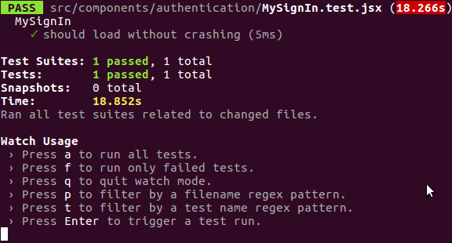
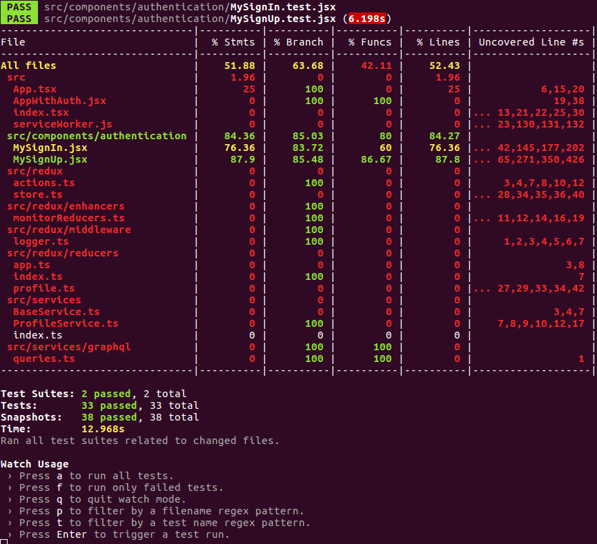

# A Serverless Project

Brought to you by [Dozen Software](https://dozensoft.com/)

## Blog Post #10 - Enzyme Testing

[Enzyme](https://github.com/airbnb/enzyme) is a JavaScript Testing utility for React that makes it easier to test your React Components' output.

If you want to skip over the previous steps, please complete the [first step](../01). And then do the following:

```sh
cd ~/projects
rm -rf my-cdk-project/*
cp -R serverless-cdk-cicd/09/. my-cdk-project/
cd my-cdk-project/cdk/assets/lambda/create-user
npm i
cd ../../..
npm i
npm run build && cdk synth
cdk deploy TodoCognito --require-approval never &> ../cdkdeployresult_cognito.txt
cdk deploy TodoAppsync --require-approval never &> ../cdkdeployresult_appsync.txt
cd ..
npm i
echo "export default {};" > src/config.js
node parseAwsOutputs.js src/config.js
npm run build
```

Then, copy the webclientid and the userpoolid from the src/config.js file that you just created - and paste them into the following

```sh
aws cognito-idp sign-up --region us-east-1 --client-id YOURWEBCLIENTID --username admin@example.com --password Passw0rd! --user-attributes '[{"Name":"custom:first_name","Value":"Admin"},{"Name":"custom:last_name","Value":"Istrator"}]'
aws cognito-idp admin-confirm-sign-up --region us-east-1 --user-pool-id YOURUSERPOOLID --username admin@example.com
```

## Steps

1. [Install dependencies](#install)
1. [setupTests.js](#setup)
1. [Quick Simple Test](#simple)
1. [Copy tests from Amplify](#copy)
1. [Coverage](#coverage)
1. [Conclusion](#conclusion)

### Step 1: Install dependencies <a name="install"></a>

```sh
npm i --save-dev enzyme enzyme-adapter-react-16
```

### Step 2: setupTests.js <a name="setup"></a>

We'll create a [src/setupTests.js](src/setupTests.js) file to pull in our dependencies and set some global functions.

[Here is more information about how this works](https://create-react-app.dev/docs/running-tests#src-setuptestsjs).

### Step 3: Quick Simple Test <a name="simple"></a>

We'll create a [src/components/authentication/MySignIn.test.jsx]() file just to see it run.

```js
import React from "react";
import MySignIn from "./MySignIn";

describe("MySignIn", () => {
  it("should load without crashing", () => {
    const wrapper = shallow(<MySignIn />);
  });
});
```

[Here's more info about shallow rendering](https://github.com/airbnb/enzyme/blob/master/docs/api/shallow.md).

Now at our root directory, we can

```sh
npm run test
```

And we should see something like this:


### Step 4: Copy tests from Amplify <a name="copy"></a>

Amplify's tests are in [their github repo](https://github.com/aws-amplify/amplify-js/tree/master/packages/aws-amplify-react/__tests__/Auth). So for my custom components, I just copied what they have and tweaked them according to the customizations I mentioned in [Step 8.3](../08#amplify).

For [MySignIn.test.jsx](src/components/authentication/MySignIn.test.jsx), I made it use `email` instead of `username` for logging in.

For [MySignUp.test.jsx](src/components/authentication/MySignUp.test.jsx), I combined their `SignUp` and `ConfirmSignUp` components.

### Step 5: Coverage <a name="coverage"></a>

If we add `--coverage` to the end of our "test" command in the [package.json](package.json) file and run `npm run test` again, it will generate a coverage report for us.



51.88% isn't great. Ha! But it's a start. I should probably test my Redux stuff too, huh?

### Conclusion

We now have a place where we can define our front end functionality via automated tests! Hooray!

It should be clear that this is a weak area in my knowledge. So if you have something you'd like to add, please create a PR.

Feel free to @ me on [twitter](https://twitter.com/murribu) or file an issue/pr on this repo if you have any questions.
