# A Serverless Project

## Blog Post #11 - Postman

[Postman](https://www.getpostman.com/) is a collaboration platform for API development. For this project, we will use it to define API tests that we can send to our Appsync API to make sure our back end functions properly.

If you want to skip over the previous steps, please complete the [first step](../01). And then do the following:

```sh
cd ~/projects
rm -rf my-cdk-project/*
cp -R serverless-cdk-cicd/10/. my-cdk-project/
cd my-cdk-project/cdk/assets/lambda/create-user
npm i
cd ../../..
npm i
npm run build && cdk synth
cdk deploy TodoCognito --require-approval never &> ../cdkdeployresult_cognito.txt
cdk deploy TodoAppsync --require-approval never &> ../cdkdeployresult_appsync.txt
cd ..
npm i
echo "export default {};" > src/config.js
node parseAwsOutputs.js src/config.js
npm run build
```

Then, copy the webclientid and the userpoolid from the output - and paste them into the following

```sh
aws cognito-idp sign-up --region us-east-1 --client-id YOURWEBCLIENTID --username admin@example.com --password Passw0rd! --user-attributes '[{"Name":"custom:first_name","Value":"Admin"},{"Name":"custom:last_name","Value":"Istrator"}]'
aws cognito-idp admin-confirm-sign-up --region us-east-1 --user-pool-id YOURUSERPOOLID --username admin@example.com
```

## Steps

1. [Download the Postman client](#download)
1. [Sign up for Postman](#sign-up)
1. [Create a request](#request)
1. [Get configuration variables](#config)
1. [Create a Postman environment](#env)
1. [Create a relevant request](#relevant)
1. [Test the response](#test)
1. [Save the request](#save)
1. [Install newman](#newman)
1. [Get API Key](#api-key)
1. [Get your collection's Id](#collection-id)
1. [Run the test](#run)
1. [Conclusion](#conclusion)

### Step 1. Download the Postman client <a name="download"></a>

This one's pretty easy. [Go here](https://www.getpostman.com/downloads/)

### Step 2. Sign up for Postman <a name="sign-up"></a>

When you first open the application, you should see a prompt to `Sign In` or there may just be a `Sign In` button in the top right. It should guide you through the process of creating an account. I used "Login with Google," but you could just create a username and password if you prefer.

### Step 3. Create a request <a name="request"></a>

First you need to [create a collection](https://learning.getpostman.com/docs/postman/collections/creating_collections/)
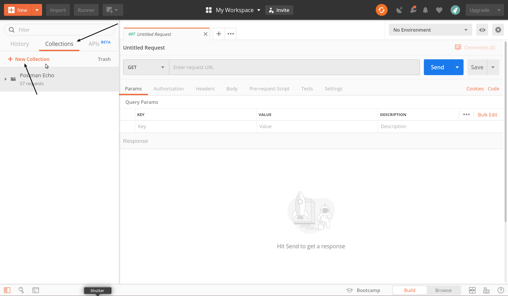

Enter `Todos` as the Collection name and click `Create`.

You can enter `https://google.com` where it says `Enter request URL` and click `Send`.
Postman just sends the `GET` request and shows you the data that it received.


### Step 4. Get configuration variables <a name="config"></a>

That's all you have to do to create a test! Obviously, we don't want to send requests to Google, but we do want to send them to our API that we created.

We'll need to have 3 pieces of data to test our first API call

1. Your API's URL
1. Your first Cognito user's `sub`
1. That user's jwt (generated by Cognito)

#### Your API's URL

Open up your [src/config.js](src/config.js) file and locate your `apiurl` (mine was `https://e7hmjlqknrhpxcgwuedmqawuzq.appsync-api.us-east-1.amazonaws.com/graphql`).

#### Your first Cognito user's `sub`

Open up your [Cognito Console](https://console.aws.amazon.com/cognito/users/?region=us-east-1) and click on your UserPool.

Then click on `Users and groups` and select one of your users to find their `sub`
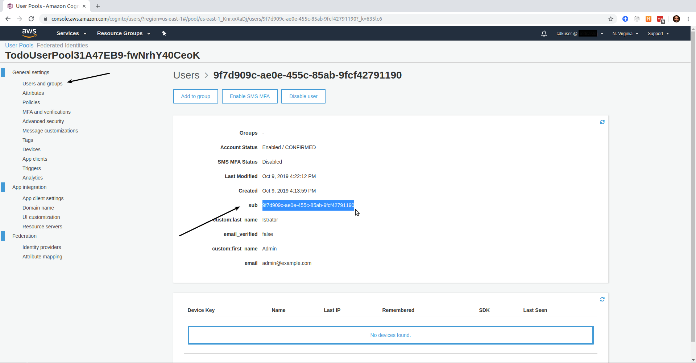. Mine is `9f7d909c-ae0e-455c-85ab-9fcf42791190`.

### Your user's JWT

I created a file called [getUserJwt.js](getUserJwt.js), which is a very-slightly modified version of the boilerplate code found [here](https://docs.aws.amazon.com/cognito/latest/developerguide/authentication.html).

It used a dependency, so we first have to install that.

```sh
npm i node-fetch
```

Then we can pass 5 things to this script and get back the user's JWT. We'll need the user's email and password, the UserPool's ID, and the WebClient's ID. The first two are whatever info you signed up with. And the last two can be found in your [src/config.js](src/config.js) file.

For me, it looked like this...

```sh
node getUserJwt.js admin@example.com Passw0rd! us-east-1_KnrxxXaDj 6e63ck816j0ep7gi5n1fbtsp6b
```

And the output should look somthing like this


### Step 5: Create a Postman environment <a name="env"></a>

Open up the Postman Client again and click on the gear icon at the top right. Then click on `Add` to create a new environment.
Then enter `Development` as the environment's name and add the three variables as show (entering your own data for the values).
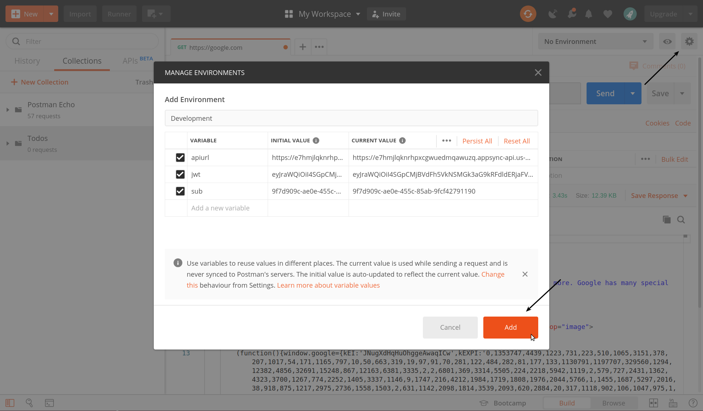

Click `Add` again to save the environment.

Then click in the dropdown box that says "No environment" and select your `Development` environment
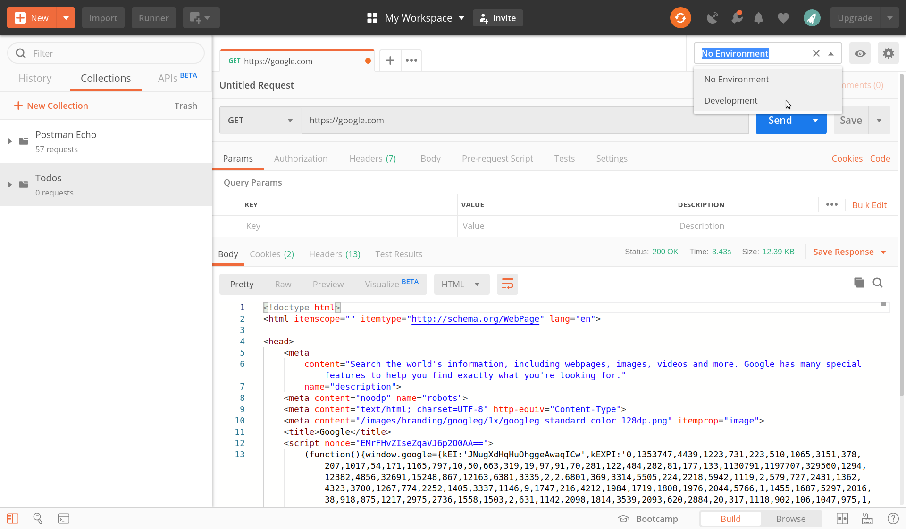

### Step 6: Create a relevant request <a name="relevant"></a>

As I said, we don't really want to send requests to Google. We want to hit our API. So, delete `https://google.com` from your `GET` request and type `{{apiurl}}` instead. This will reference the `apiurl` variable in your environment.

Then click on the dropdown arrow next to `GET` and change it to `POST`.

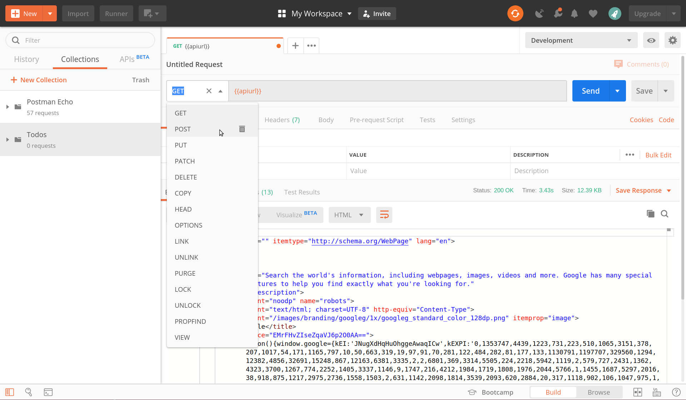

Now we need to formulate the request's body. Click on `Body`, then `GraphQL`, and paste the query into the input box. You can find this query at [src/services/graphql/queries.ts](src/services/graphql/queries.ts)
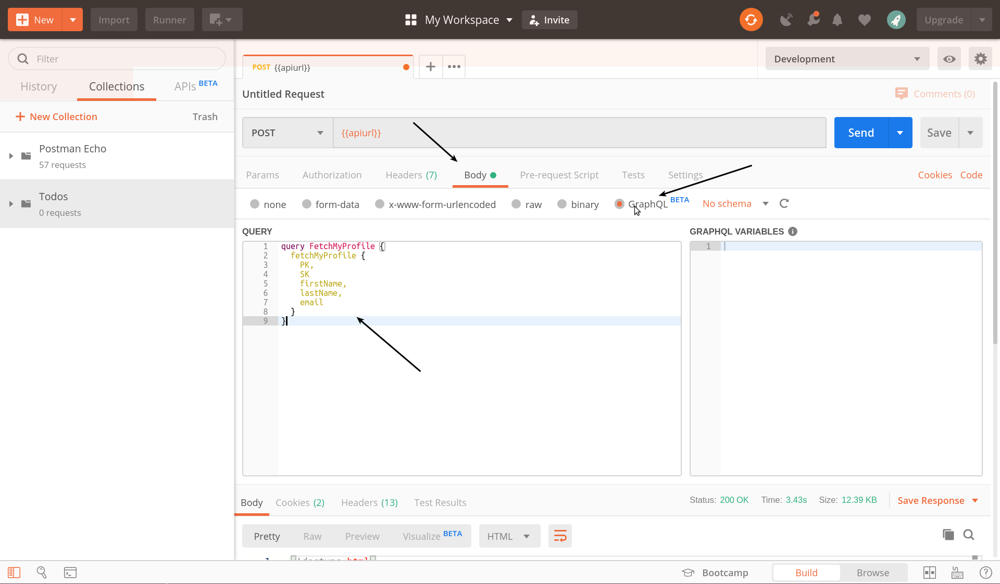

And finally, we need to give the request our authorization header. Click on `Headers` and enter `authorization` and then enter `{{jwt}}` to reference your environment variable. Click `Send` and you should see a response kinda like this.

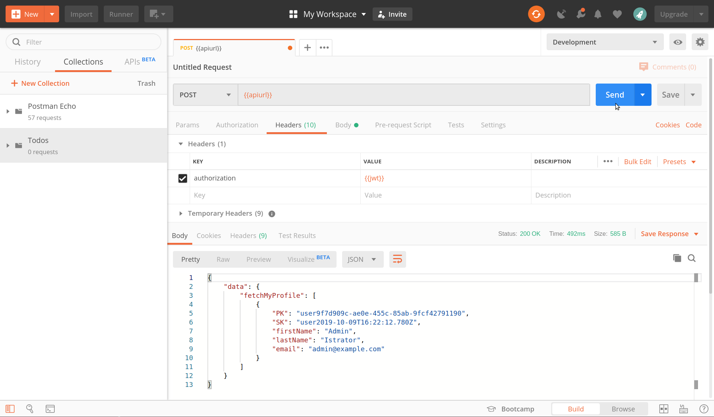

### Step 7: Test the response <a name="test"></a>

Use [Postman tests](https://learning.getpostman.com/docs/postman/scripts/test_scripts/) to analyze the response.

Click on `Tests` and paste in the following

```js
pm.test("Status code is 200", function() {
  pm.response.to.have.status(200);
});
pm.test("User data is present", function() {
  var jsonData = pm.response.json();
  var user = jsonData.data.fetchMyProfile.find(function(d) {
    return d.SK.substring(0, 4) === "user";
  });
  pm.expect(user.PK).to.eql("user" + pm.environment.get("sub"));
});
```

Then click `Send`. You should see that 2/2 tests passed. Yay! You can click on `Test Results` for more info. This is usually helpful when there is a failed test.

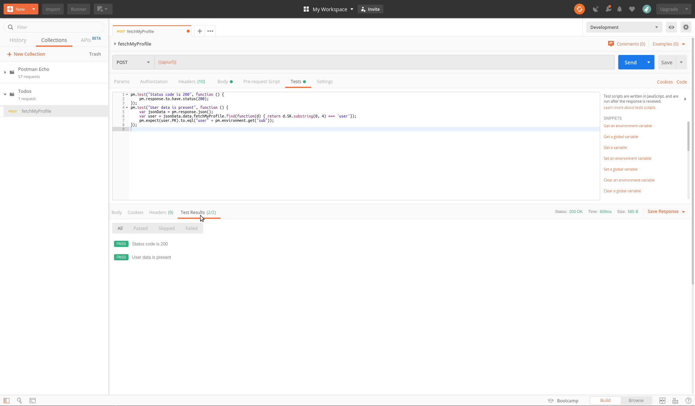

### Step 8: Save the request <a name="save"></a>

`Ctrl-s` should bring up the save modal. Give your request a name and save it to your collection
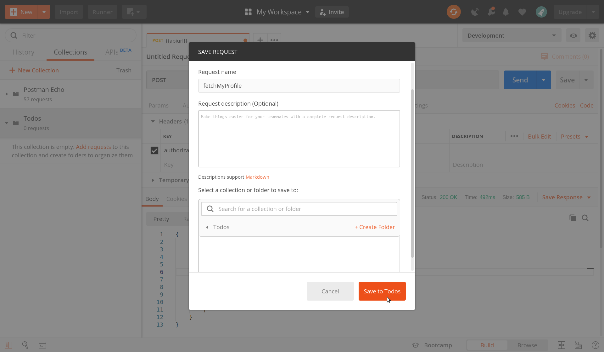

### Step 9: Install newman <a name="newman"></a>

```sh
npm i -g newman
```

That's it

### Step 10: Get API Key <a name="api-key"></a>

This was way more complicated than I figured it would be. Perhaps there's an easier way.

#### Go to your [dashboard](https://app.getpostman.com/dashboard/integrations)


#### Click on `Integrations` and then `Create an integration in this workspace`


#### Click on `View Details`


#### Click on `Generate API Key`

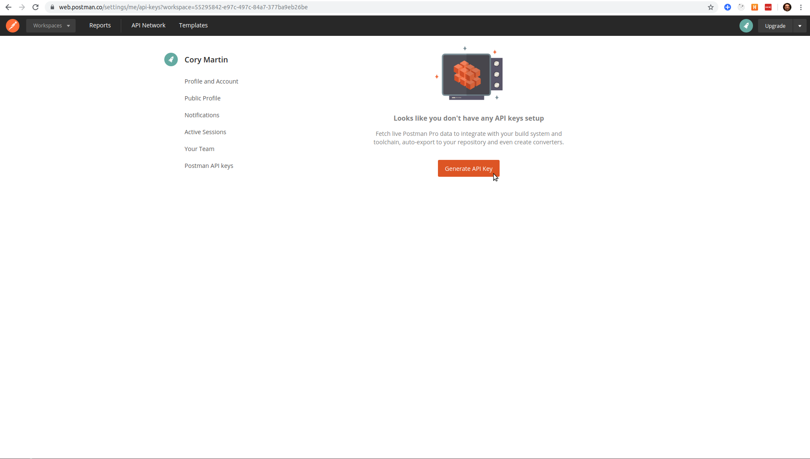

#### Give it a name


#### Copy the key to your clipboard

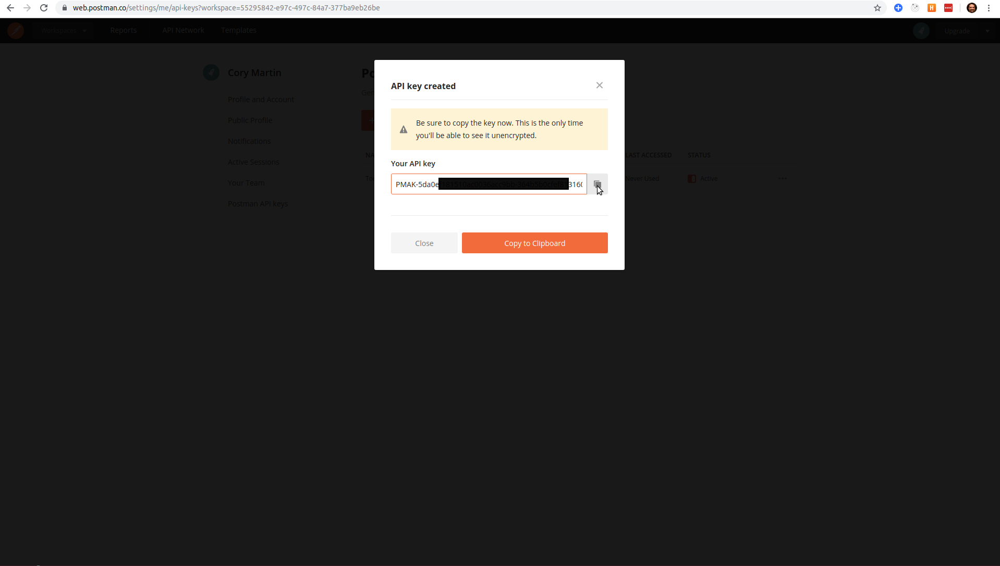

Hang on to this key. Save it in a text file somewhere

### Step 11: Get your collection's Id <a href="collection-id"></a>

In the Postman client, click on the little triangle next to your Collection's name and then click on `View in web`
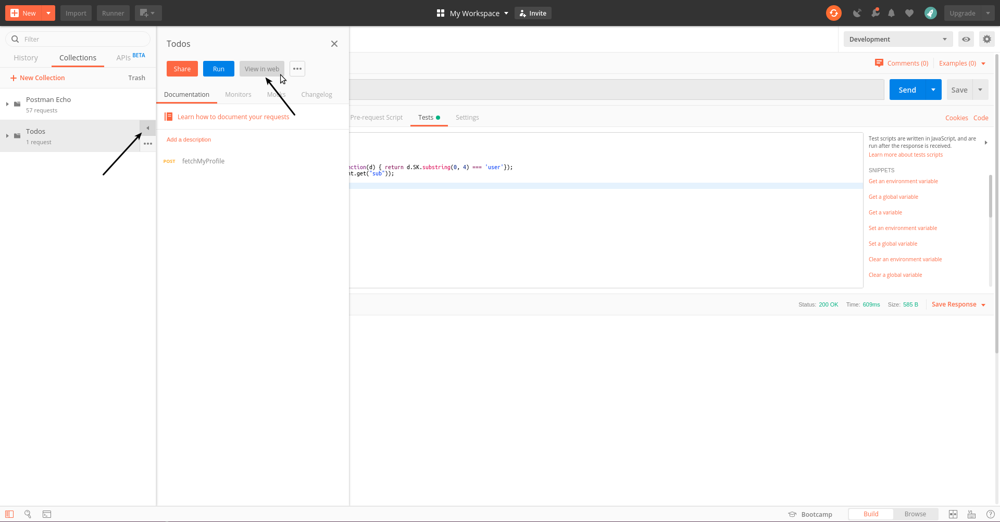

That should open up a web browser whose URL will have the collection id.
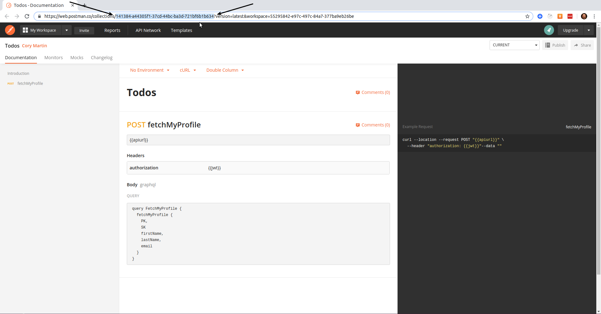

Copy that Collection Id that you see highlighted in the screenshot. Mine is `141384-a44305f1-37cd-44bc-ba3d-721bf6b1b634`.

### Step 12: Get your environment's id <a name="environment-id"></a>

[Follow this documentation](https://docs.api.getpostman.com/?_ga=2.89629144.272624084.1570822578-384693420.1543112474&version=latest#d26bd079-e3e1-aa08-7e21-66f55df99351)

Basically, create a new request, using your API Key to retrive your account's environments.
. Mine is `9d799c15-3e42-4d78-a72a-5bd57b5aefb3`

### Step 13: Run the test <a name="run"></a>

```sh
newman run https://api.getpostman.com/collections/141384-a44305f1-37cd-44bc-ba3d-721bf6b1b634?apikey=PMAK-5daREDACTED0ac0036acc9bb-36REDACTEDf813160REDACTED1c27d682e --environment https://api.getpostman.com/environments/9d799c15-3e42-4d78-a72a-5bd57b5aefb3?apikey=PMAK-5daREDACTED0ac0036acc9bb-36REDACTEDf813160REDACTED1c27d682e
```

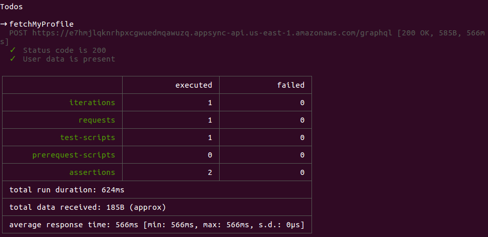

Success!

### Conclusion

Now, we've got a Postman Collection where we can define how we expect our API to behave. And it can all be automated!

If anything is unclear, @ me on [twitter](https://twitter.com/murribu) or file an issue/pr on this repo.
